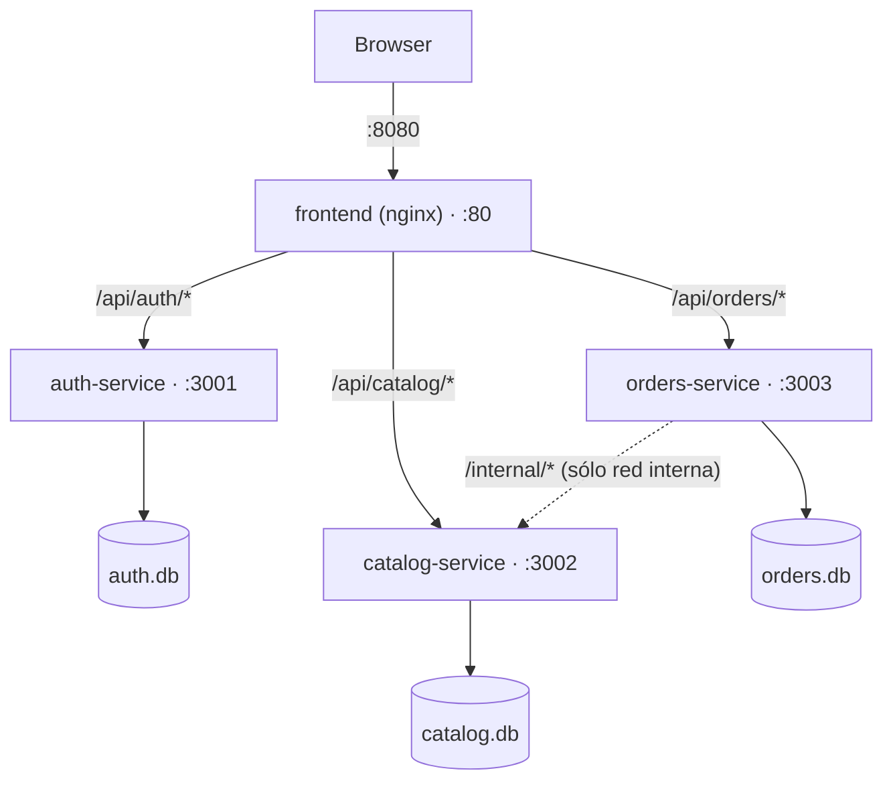

# Arquitectura

Reponé corre como 4 contenedores separados (`docker-compose.yml` en la raíz): un frontend estático servido por nginx y tres backends en Node/Express, cada uno con su propia SQLite. `nginx` es el único punto de entrada real — rutea por prefijo de path hacia el servicio dueño de cada dominio, mismo patrón que va a cumplir el Ingress de Traefik cuando esto pase a k3s.

## Estructura de carpetas

```
client/                  frontend (React + Vite + TS + Tailwind)
  src/mobile/             pantallas del flujo mobile: login → home → scan → alta/ficha de producto → pedido → resumen
  src/desktop/             vista de escritorio: sidebar de proveedores + tabla de pedido
  src/hooks/                lógica compartida entre las dos vistas (ej. useOrderBuilder arma el pedido en memoria)
  src/components/            piezas de UI reutilizables (íconos, etc.)
  src/data/                   tipos y helpers puros (fmtMoney, fmtDate) sin llamadas a red
  src/api.ts                   único punto de contacto con los backends — el resto del cliente nunca hace fetch directo
  nginx.conf, Dockerfile         cómo se sirve en producción: build estático + proxy por prefijo hacia los 3 backends

services/
  auth-service/              negocios, usuarios, login/registro, emite y valida el JWT
  catalog-service/            proveedores, productos, más las rutas /internal/* que usa orders-service
  orders-service/              alta y envío de pedidos; sin acceso a la DB de catalog-service, le pide los datos por HTTP

  (mismo layout en los tres: src/routes/ = endpoints, src/lib/ = JWT + validación de body, src/db.ts = schema SQLite)

docs/
  architecture.md              este archivo

.github/workflows/
  <servicio>.yml               build + push a ECR de cada servicio, dispara sólo cuando cambia su carpeta

docker-compose.yml           levanta los 4 servicios juntos para probar en local antes de tocar el cluster
```

Todavía no existen (quedan para el final de la migración, ver plan): `terraform/` (EC2 con k3s, ECR, IAM OIDC, DNS en Cloudflare) y `k8s/` (manifiestos Kustomize + Application CRs de ArgoCD).



## Por qué estos límites de servicio

- **auth-service** — dueño de `businesses` y `users`. Firma un JWT (HS256) en vez de guardar sesiones en tabla: los otros dos servicios verifican la firma localmente, sin llamarlo en cada request.
- **catalog-service** — dueño de `providers` y `products`. Expone además rutas `/internal/*` (no pasan por nginx, no público) que sólo usa `orders-service` para validar un proveedor y sacar snapshot de stock/precio al armar un pedido.
- **orders-service** — dueño de `orders`/`order_items`. No tiene acceso a la DB de catálogo; guarda `business_id` duplicado en su propia tabla para poder filtrar por comercio sin ir a preguntarle a `catalog-service` en cada lectura.

El flag `pending` de cada proveedor (si su último pedido ya se mandó) se compone del lado del cliente (`client/src/api.ts`), pegándole a `catalog-service` y `orders-service` por separado — ningún backend tiene acceso directo a la tabla del otro.

## Puertos

| Servicio | Puerto interno | Puerto host (compose) | ¿Público hoy? | Nota |
|---|---|---|---|---|
| frontend (nginx) | 80 | 8080 | será el único, vía Ingress | sirve el build de Vite y proxea `/api/*` |
| auth-service | 3001 | 3001 | no | sólo debug local |
| catalog-service | 3002 | 3002 | no | expone además `/internal/*` |
| orders-service | 3003 | 3003 | no | le pega a `catalog-service` por `/internal/*` |

Los tres backends quedan mapeados al host hoy sólo para poder debuggearlos con curl mientras desarrollamos. En k3s van a quedar como `ClusterIP` (sin puerto de host) — el único punto público va a ser el Ingress delante de `frontend`, en `repone.landriel.site`.

## Estado del pipeline de CI

Cada servicio tiene (o va a tener) su propio workflow en `.github/workflows/`, disparado sólo cuando cambia su carpeta, que buildea la imagen y la pushea a ECR usando un rol OIDC (sin AWS keys guardadas en el repo):

- [x] `auth-service.yml`
- [ ] `catalog-service.yml`
- [ ] `orders-service.yml`
- [ ] `frontend.yml`

Terraform (repos ECR, rol OIDC, EC2 con k3s+ArgoCD, DNS en Cloudflare) y los manifiestos de k8s quedan para el final — ver el plan de la migración.
